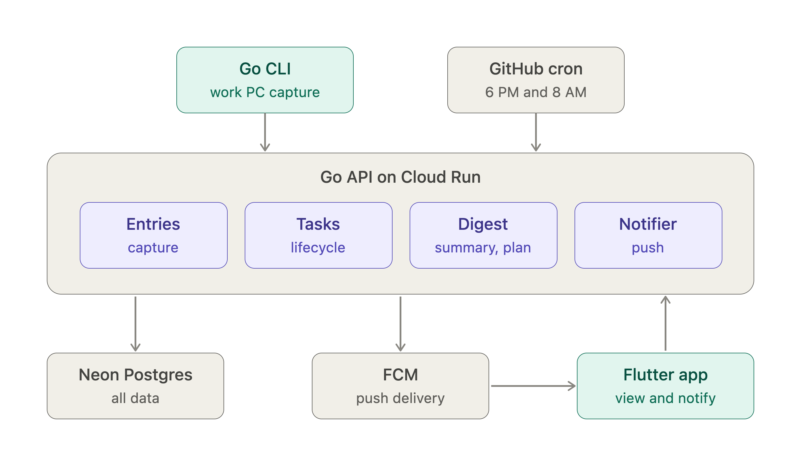
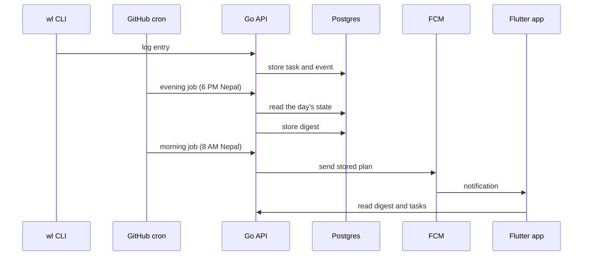

# Architecture

Worklog is a modular monolith: one Go service with clear internal modules.

## Components
- **cli/**: Go CLI used on the work PC to log entries
- **server/**: Go API deployed on Cloud Run
  - entries: capture
  - tasks: lifecycle and blockers
  - digest: end-of-day summary and tomorrow's plan
  - notifier: push via FCM
  - jobs: handlers called by the scheduled triggers
- **Neon Postgres**: all data
- **GitHub Actions cron**: calls the jobs endpoints each evening and morning
- **mobile/**: Flutter app to view digests and receive notifications

## Daily flow

## Key decisions
See [decisions](decisions/).
